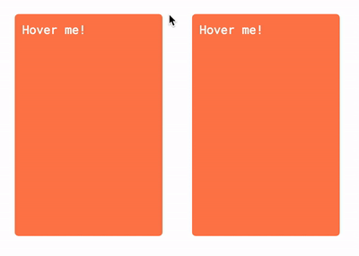

# hover-hand

hover effect like Open IA articles (rotation 3D)

## install
```
npm install --save hover-hand
```
## example

<p align="center">
  
</p>

## use

```js
new Hover ('.class') // <- class

// or

new Hover (
  document.querySelectorAll('.class') // <- node elements
)
```
